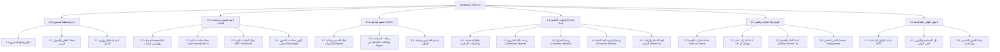

# BuildMatch — هيكل تقسيم العمل (Work Breakdown Structure — WBS)

```mermaid
graph TD
    BM["BuildMatch Platform"]
    
    BM --> W1["1.0 إدارة وتخطيط المشروع"]
    W1 --> W11["1.1 ميثاق ونطاق المشروع"]
    W1 --> W12["1.2 خطة التعافي والجدول الزمني"]
    W1 --> W13["1.3 تقييم المخاطر وتوزيع الأدوار"]

    BM --> W2["2.0 البنية المعمارية وقاعدة البيانات"]
    W2 --> W21["2.1 هجرات PostgreSQL وقواميس البيانات"]
    W2 --> W22["2.2 سياسات أمان Row Level Security (RLS)"]
    W2 --> W23["2.3 دوال العمليات الذرية (RPC Functions)"]
    W2 --> W24["2.4 تكوين مساحات التخزين السحابي (Storage)"]

    BM --> W3["3.0 تصميم الواجهات (UI/UX)"]
    W3 --> W31["3.1 نظام التصميم ومكتبة المكونات (Tokens)"]
    W3 --> W32["3.2 رحلات المستخدم والشاشات التفاعلية في Figma"]
    W3 --> W33["3.3 تسليم التصاميم وضوابط التجاوب"]

    BM --> W4["4.0 الواجهات الأمامية (Front-End)"]
    W4 --> W41["4.1 نظام المصادقة والحسابات الأساسية"]
    W4 --> W42["4.2 وحدة مالك المشروع (Landowner Module)"]
    W4 --> W43["4.3 وحدة المقاول (Contractor Module)"]
    W4 --> W44["4.4 وحدة إدارة ومتابعة التنفيذ (Execution Module)"]
    W4 --> W45["4.5 لوحة التحكم والرقابة الإدارية (Admin UI)"]

    BM --> W5["5.0 الجودة والاختبارات والنشر"]
    W5 --> W51["5.1 اختبارات الوحدة (Unit Tests via Vitest)"]
    W5 --> W52["5.2 اختبارات أمان RLS وقواعد البيانات"]
    W5 --> W53["5.3 أتمتة البناء والفحص (GitHub Actions CI)"]
    W5 --> W54["5.4 النشر السحابي (Vercel Deployment)"]

    BM --> W6["6.0 التوثيق النهائي والمناقشة"]
    W6 --> W61["6.1 ملفات التوثيق الشاملة لـ DEPI"]
    W6 --> W62["6.2 دليل المستخدم والتقرير الفني النهائي"]
    W6 --> W63["6.3 إعداد العرض التقديمي والمناقشة"]
```
