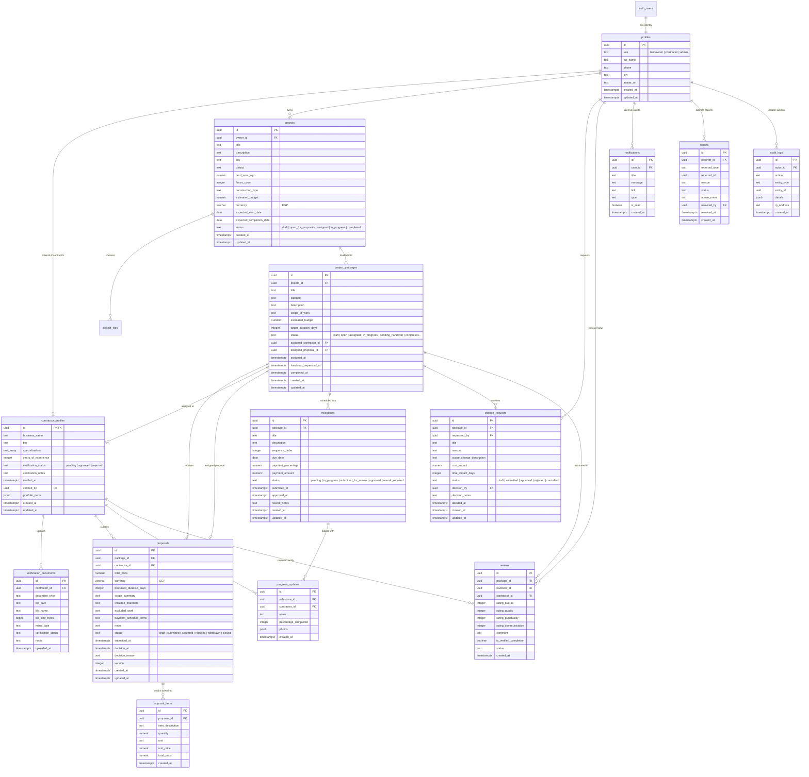

# BuildMatch — مخطط العلاقات الكيانية (Entity Relationship Diagram — ERD)

## 1. مخطط الكيانات والعلاقات الكامل (Mermaid ERD)

```mermaid
erDiagram
    auth_users ||--|| profiles : "has identity"
    profiles ||--o| contractor_profiles : "extends if contractor"
    contractor_profiles ||--o{ verification_documents : "uploads"
    
    profiles ||--o{ projects : "owns"
    projects ||--o{ project_files : "contains"
    projects ||--|{ project_packages : "divided into"
    
    project_packages ||--o{ proposals : "receives"
    contractor_profiles ||--o{ proposals : "submits"
    proposals ||--o{ proposal_items : "breaks down into"
    
    project_packages ||--o| contractor_profiles : "assigned to"
    project_packages ||--o| proposals : "assigned proposal"
    
    project_packages ||--o{ milestones : "scheduled into"
    milestones ||--o{ progress_updates : "logged with"
    contractor_profiles ||--o{ progress_updates : "authors"
    
    project_packages ||--o{ change_requests : "receives"
    profiles ||--o{ change_requests : "requests"
    
    project_packages ||--o{ reviews : "evaluated in"
    profiles ||--o{ reviews : "writes review"
    contractor_profiles ||--o{ reviews : "reviewed entity"
    
    profiles ||--o{ notifications : "receives alerts"
    profiles ||--o{ reports : "submits reports"
    profiles ||--o{ audit_logs : "initiates actions"

    profiles {
        uuid id PK
        text role "landowner | contractor | admin"
        text full_name
        text phone
        text city
        text avatar_url
        timestamptz created_at
        timestamptz updated_at
    }

    contractor_profiles {
        uuid id PK,FK
        text business_name
        text bio
        text_array specializations
        integer years_of_experience
        text verification_status "pending | approved | rejected"
        text verification_notes
        timestamptz verified_at
        uuid verified_by FK
        jsonb portfolio_items
        timestamptz created_at
        timestamptz updated_at
    }

    verification_documents {
        uuid id PK
        uuid contractor_id FK
        text document_type
        text file_path
        text file_name
        bigint file_size_bytes
        text mime_type
        text verification_status
        text notes
        timestamptz uploaded_at
    }

    projects {
        uuid id PK
        uuid owner_id FK
        text title
        text description
        text city
        text district
        numeric land_area_sqm
        integer floors_count
        text construction_type
        numeric estimated_budget
        varchar currency "EGP"
        date expected_start_date
        date expected_completion_date
        text status "draft | open_for_proposals | assigned | in_progress | completed..."
        timestamptz created_at
        timestamptz updated_at
    }

    project_packages {
        uuid id PK
        uuid project_id FK
        text title
        text category
        text description
        text scope_of_work
        numeric estimated_budget
        integer target_duration_days
        text status "draft | open | assigned | in_progress | pending_handover | completed..."
        uuid assigned_contractor_id FK
        uuid assigned_proposal_id FK
        timestamptz assigned_at
        timestamptz handover_requested_at
        timestamptz completed_at
        timestamptz created_at
        timestamptz updated_at
    }

    proposals {
        uuid id PK
        uuid package_id FK
        uuid contractor_id FK
        numeric total_price
        varchar currency "EGP"
        integer proposed_duration_days
        text scope_summary
        text included_materials
        text excluded_work
        text payment_schedule_terms
        text notes
        text status "draft | submitted | accepted | rejected | withdrawn | closed"
        timestamptz submitted_at
        timestamptz decision_at
        text decision_reason
        integer version
        timestamptz created_at
        timestamptz updated_at
    }

    proposal_items {
        uuid id PK
        uuid proposal_id FK
        text item_description
        numeric quantity
        text unit
        numeric unit_price
        numeric total_price
        timestamptz created_at
    }

    milestones {
        uuid id PK
        uuid package_id FK
        text title
        text description
        integer sequence_order
        date due_date
        numeric payment_percentage
        numeric payment_amount
        text status "pending | in_progress | submitted_for_review | approved | rework_required"
        timestamptz submitted_at
        timestamptz approved_at
        text rework_notes
        timestamptz created_at
        timestamptz updated_at
    }

    progress_updates {
        uuid id PK
        uuid milestone_id FK
        uuid contractor_id FK
        text notes
        integer percentage_completed
        jsonb photos
        timestamptz created_at
    }

    change_requests {
        uuid id PK
        uuid package_id FK
        uuid requested_by FK
        text title
        text reason
        text scope_change_description
        numeric cost_impact
        integer time_impact_days
        text status "draft | submitted | approved | rejected | cancelled"
        uuid decision_by FK
        text decision_notes
        timestamptz decided_at
        timestamptz created_at
        timestamptz updated_at
    }

    reviews {
        uuid id PK
        uuid package_id FK
        uuid reviewer_id FK
        uuid contractor_id FK
        integer rating_overall
        integer rating_quality
        integer rating_punctuality
        integer rating_communication
        text comment
        boolean is_verified_completion
        text status
        timestamptz created_at
    }

    notifications {
        uuid id PK
        uuid user_id FK
        text title
        text message
        text link
        text type
        boolean is_read
        timestamptz created_at
    }

    reports {
        uuid id PK
        uuid reporter_id FK
        text reported_type
        uuid reported_id
        text reason
        text status
        text admin_notes
        uuid resolved_by FK
        timestamptz resolved_at
        timestamptz created_at
    }

    audit_logs {
        uuid id PK
        uuid actor_id FK
        text action
        text entity_type
        uuid entity_id
        jsonb details
        text ip_address
        timestamptz created_at
    }
```
