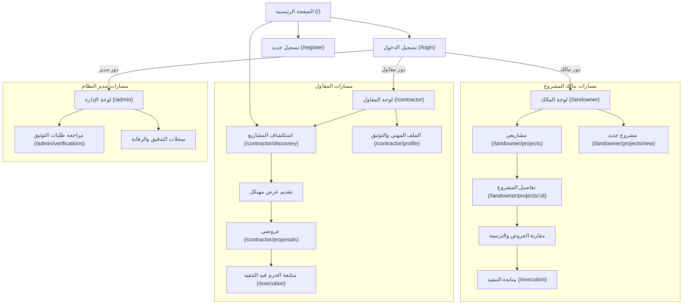

# BuildMatch — خريطة التنقل وتدفقات المستخدم (Navigation Map & User Flows)

## 1. خريطة التنقل الشاملة (Mermaid Navigation Map)

```mermaid
flowchart TD
    Home["الصفحة الرئيسية (/)"]
    Login["تسجيل الدخول (/login)"]
    Register["تسجيل جديد (/register)"]
    Discovery["استكشاف المشاريع (/contractor/discovery)"]

    Home --> Login
    Home --> Register
    Home --> Discovery

    subgraph LandownerFlow ["مسارات مالك المشروع"]
        LDash["لوحة المالك (/landowner)"]
        LProjects["مشاريعي (/landowner/projects)"]
        LNew["مشروع جديد (/landowner/projects/new)"]
        LDetail["تفاصيل المشروع (/landowner/projects/:id)"]
        LCompare["مقارنة العروض والترسية"]
        LExec["متابعة التنفيذ (/execution)"]

        LDash --> LProjects
        LDash --> LNew
        LProjects --> LDetail
        LDetail --> LCompare
        LCompare --> LExec
    end

    subgraph ContractorFlow ["مسارات المقاول"]
        CDash["لوحة المقاول (/contractor)"]
        CProfile["الملف المهني والتوثيق (/contractor/profile)"]
        CProposals["عروضي (/contractor/proposals)"]
        CApply["تقديم عرض مهيكل"]
        CExec["متابعة الحزم قيد التنفيذ (/execution)"]

        CDash --> CProfile
        CDash --> Discovery
        Discovery --> CApply
        CApply --> CProposals
        CProposals --> CExec
    end

    subgraph AdminFlow ["مسارات مدير النظام"]
        ADash["لوحة الإدارة (/admin)"]
        AVerif["مراجعة طلبات التوثيق (/admin/verifications)"]
        AAudit["سجلات التدقيق والرقابة"]

        ADash --> AVerif
        ADash --> AAudit
    end

    Login -->|دور مالك| LDash
    Login -->|دور مقاول| CDash
    Login -->|دور مدير| ADash
```
